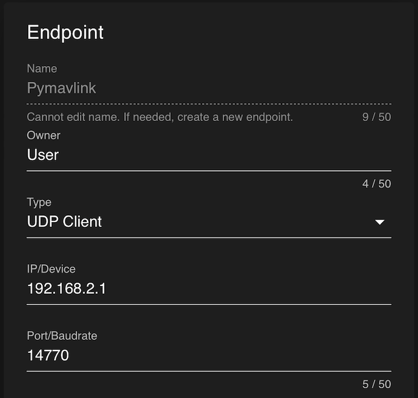

+++
title = "Advanced Usage"
description = "BlueOS advanced usage documentation."
date = 2022-04-22T11:45:00+10:00
template = "docs/page.html"
sort_by = "weight"
weight = 30
draft = false
[extra]
lead = ''
toc = true
top = false
+++
## Debugging

### Network Test, etc

## Pirate Mode

### MAVLink Endpoints

Clients seem to be most stable

