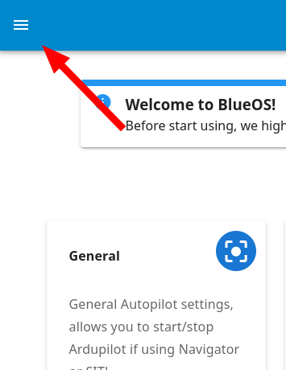

+++
title = "Configuration / Usage"
description = "Companion Docker configuration instructions."
date = 2021-10-20T22:20:00+00:00
template = "docs/page.html"
sort_by = "weight"
weight = 20
draft = false
[extra]
lead = ''
toc = true
top = false
+++
## Network Configuration

Your topside computer’s network configuration should be the same as for the previous Companion software. 
To configure it, you can follow our [network setup instructions](https://www.ardusub.com/quick-start/installing-companion.html#network-setup).

## New Web Interface

The new Companion software is designed to be a modular collection of services, which generally each provide a REST API, documentation, and a development webpage.
The web interface monitors the autopilot and other main software components, and also listens for and displays connections from other HTTP servers (on TCP ports) and docker containers, so you can keep your own integrations isolated from the normal Companion release/update cycle.

### Interface Access

You can access companion via the old IP address ([192.168.2.2](http://192.168.2.2/)) or via [companion.local](http://companion.local/).

### Interface Features

When you first open the web interface, you'll see a page that looks like this:

Of particular note is the header, which contains:
- the main hamburger menu (top left corner), for managing your flight controller and accessing some useful tools, and
- health, wifi, network, and notification indicators (top right corner)

## Updating / Releases

There are 3 types of releases on the new Companion:
1. Stable releases (not available during the B.E.T.A. period)
   - Stable versions with long-term support
2. B.E.T.A. releases
   - Versions that will be released after an internal test
3. Master releases (highly volatile, not recommended)
   - The very latest features, that may not have been tested yet

We recommend using only the B.E.T.A. releases.

Versions and change-logs are on the [GitHub versions page](https://github.com/bluerobotics/companion-docker/releases)

### Connect Wifi

When starting out, it's important to connect to wifi so you can update to the latest suitable release.

1. First, click the wifi indicator to scan for available wifi networks

   
1. Select the desired network, type in the password, and click connect

   
1. Once connected, the wifi icon will change to show the signal strength, and the connected wifi network will be selected on the menu

   

### Select Version

Now that your Companion has an internet connection, you can perform the update to the latest available version.

1. Click on the hamburger menu

   
1. Under **tools**, select **Version-Chooser**

   
1. If you're already on the latest version, the right side of your Local Version will be blank. If not, you should see a blue **Update** button.

   
1. It's also possible to update between different versions (in both directions)

   
1. Once the update button is clicked the update process will run.
   Please wait until it finishes - it will automatically reload the webpage for you.

### Cleaning Up

After finishing an update, we highly recommend doing a reboot procedure on your companion computer

#### Reboot
1. Open the power menu

   
1. And restart the system

   

## Connect to QGroundControl

> **Note:** This configuration will not be necessary if you are running the latest QGC available (master), that has mdns support, with the latest Windows, MacOS or Linux configured with avahi.

When starting the web interface, you'll likely see a message that says
> New Companion doesn't provide a fixed UDP Client endpoint on 192.168.2.1 anymore. For new connections Companion now provides an UDP Server locally on port 14550. For connecting QGroundControl, for example, please go to Comm Links and create an UDP endpoint pointing to companion.local or Companion's IP address (e.g.:192.168.2.2), on port 14550.

This section steps through that process.

### [QGC 4.1](https://github.com/mavlink/qgroundcontrol/releases/tag/v4.1.4)

1. Click the QGC logo in the top left corner, and select "Application Settings"

   
1. Select "Comm Links" in the sidebar, and "Add" a new one

   
1. Give the link a name, select UDP, specify port 14550, and add the Server Address

   
1. Click "OK" to confirm the link creation

   
1. Select your new link and click "Connect"

   
1. QGC should now be able to communicate with the Pixhawk (assuming Companion is connected, and your computer's network settings have been configured correctly)

## Camera Streams

> **Note:** A connected H264 camera should be automatically configured as a default stream by the camera manager when you start Companion. If not, make sure your camera is properly connected, and that Companion is on the latest available version. Reset settings and restart companion if necessary.

The new Companion software is capable of configuring and streaming multiple cameras simultaneously. Only one will be set up as the default stream, so if it's not the one you wanted (or if you want several streams) then these instructions cover how to set up a stream manually.

1. Go to Autopilot / Video in the hamburger menu of the web interface

   
1. Click "Add Stream" on the desired camera

   
1. Specify a name, select the stream properties, and click "Create"

   
