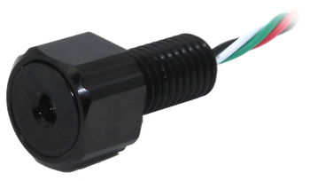
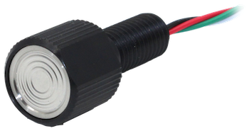

+++
title = "Pressure Sensor"
description = "Allows estimating vehicle depth."
date = 2022-10-11T17:33:19+11:00
template = "docs/page.html"
sort_by = "weight"
weight = 5
draft = false
[extra]
lead = ""
toc = true
top = false
+++

An external pressure sensor is required for obtaining depth readings and enabling Depth Hold functionality. Only one sensor may be connected at a time.

ArduSub has pre-installed drivers for the following sensor types:

* [Measurement Specialties MS5837-30BA](https://www.te.com/commerce/DocumentDelivery/DDEController?Action=showdoc&DocId=Data+Sheet%7FMS5837-30BA%7FB1%7Fpdf%7FEnglish%7FENG_DS_MS5837-30BA_B1.pdf%7FCAT-BLPS0017)
* [Keller 7LD Series](https://download.keller-druck.com/api/download/2LfcGMzMbeHdjFbyUd5DWA/en/latest)

## Supported Sensor Products

 

The following sensor products may be directly connected to an [autopilot](/introduction/hardware-options/required-hardware/autopilot.md):
* [Bar30 High-Resolution 300m Depth/Pressure Sensor](https://bluerobotics.com/store/sensors-sonars-cameras/sensors/bar30-sensor-r1/)
* [PCB for Bar30 High-Resolution 300m Depth/Pressure Sensor](https://bluerobotics.com/store/sensors-sonars-cameras/sensors/bar30-sensor-pcb-r1/)
* [Bar100 High-Resolution 1000m Depth/Pressure Sensor](https://bluerobotics.com/store/sensors-sonars-cameras/sensors/bar100-sensor-r2-rp/)

There is a comparison [in the Blue Robotics Technical Reference](https://bluerobotics.com/learn/technical-reference/#temperature-and-pressuredepth-sensors).
