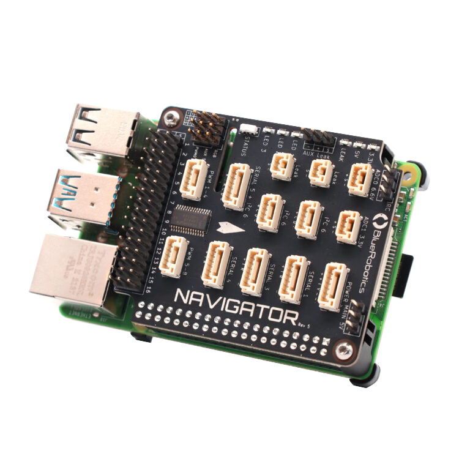
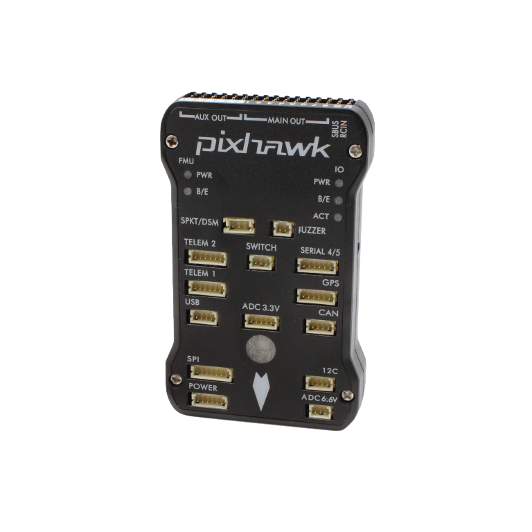

+++
title = "Flight Controller Board"
description = "Processes the pilot input and sensor data, and controls the lights and actuators on the vehicle."
date = 2022-10-11T17:33:19+11:00
template = "docs/page.html"
sort_by = "weight"
weight = 0
draft = false
[extra]
lead = ""
toc = true
top = false
+++

In the ArduSub control system, the flight controller board is the hardware component which the ArduSub autopilot firmware is loaded onto. The autopilot processes the pilot input and sensor data, and controls the motors, lights, servos, and relays on the vehicle.

Although there are many different flight controller boards available, here are the general characteristics:
* Ability to load any ArduPilot binary firmware file (Copter, Plane, Rover/Boat, Sub)
* Manual control and semi-autonomous/stablilised "flight" modes
* Autonomous waypoint-based control (with an appropriate positioning sensor)
* Various input and output connections for connecting multiple peripherals
* Embedded IMU(s), magnetic compass(es) and gyroscope(s) to determine vehicle's orientation
* Capable of transmitting telemetry data, and saving vehicle logs

## Recommended Flight Controllers

The first flight controller board recommended for ArduSub was the [Pixhawk 1](https://docs.px4.io/v1.10/en/flight_controller/pixhawk.html) manufactured by 3D Robotics (3DR) from 2013-2016. When 3DR exited manufacturing hardware in 2016, different manufacturers took the open source design files and created their own flight controllers. The original Pixhawk design has been retired, and Blue Robotics has designed the Navigator as a modern replacement that is tailored to ArduSub use cases.

 

The following list is the recommended flight controller boards for use with ArduSub:
1. [Blue Robotics Navigator](https://bluerobotics.com/store/comm-control-power/control/navigator/) (requires Raspberry Pi 4B [Onboard Computer](../onboard-computer/))
1. The original [3DR (3D Robotics) Pixhawk 1](https://docs.px4.io/v1.10/en/flight_controller/pixhawk.html)
1. [mRobotics (Mayan Robotics) Pixhawk 1](https://docs.px4.io/v1.10/en/flight_controller/mro_pixhawk.html)
1. [HolyBro Pixhawk 4](http://www.holybro.com/product/pixhawk-4/)
1. [Cube Module](https://docs.cubepilot.org/user-guides/autopilot/the-cube-module-overview)

There is a comparison [in the Blue Robotics Technical Reference](https://bluerobotics.com/learn/technical-reference#flight-controller-boards).

## Not Recommended Flight Controllers

With feedback from other users, the following flight controller boards are not recommended for use with Ardusub:

1. [RadioLink Pixhawk](https://www.foxtechfpv.com/pixhawk-autopilot-combo.html) 
    * Issues: Proprietary firmware binaries, only works with RadioLink version of Mission Planner, incorrect connectors.
1. Any flight controller with [Picoblade](https://www.molex.com/molex/products/family/picoblade) series connectors instead of [JST-GH](https://bluerobotics.com/learn/wl-connector-standard/#jst-gh-series) or [DF13](https://bluerobotics.com/learn/wl-connector-standard/#hirose-df13-series-not-recommended-for-new-designs) connectors.
    * Issue: Is not connector compatible with Blue Robotics products.

## Other Flight Controllers That Haven't Been Tested

ArduPilot has has a list of other compatible flight controllers: [Autopilot Hardware Options](https://ardupilot.org/copter/docs/common-autopilots.html)

These boards have not been tested or reported to work with ArduSub. 
