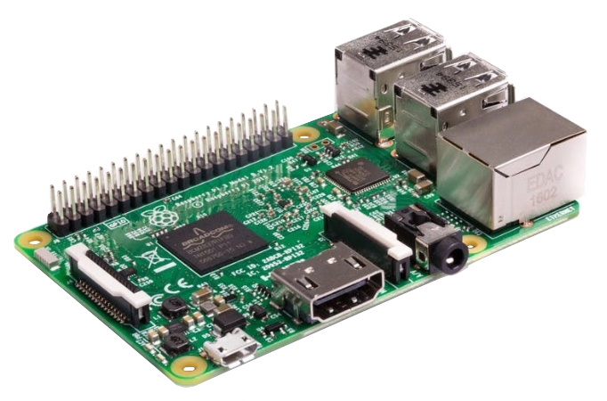
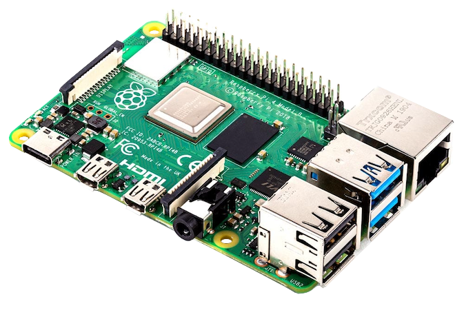

+++
title = "Onboard (Companion) Computer"
description = "Streams video and relays communications between the autopilot and control station. Enables custom device/sensor integrations"
date = 2022-10-11T17:33:19+11:00
template = "docs/page.html"
sort_by = "weight"
weight = 5
draft = false
[extra]
lead = ""
toc = true
top = false
+++

Onboard Computers are usually small single board computers (SBCs) which can be connected to an [Autopilot Board](../autopilot/), and can facilitate [MAVLink](https://ardupilot.org/dev/docs/mavlink-basics.html) communications with the [Control Station](../control-computer/) as well as enable interfacing and processing of sensors the autopilot is poorly suited to handle.

When paired with an independent Autopilot Board (e.g. Pixhawk) the Onboard Computer is sometimes called a Companion Computer. Other boards like the Navigator use the Onboard Computer as a host, and cannot run without one.

An ArduSub-based vehicle is expected to include an Onboard Computer running [BlueOS](../../software/onboard-computer/) or the older [ArduSub Companion Computer Software](https://github.com/bluerobotics/companion) (often refered to as the "Companion Software").

## Supported Hardware

 

BlueOS can run on Raspberry Pi boards from the 3 Model B and onwards. It is designed to be portable, and support for additional Linux-based SBCs will come in future. Contributions are welcomed.

The Companion Software is **only** supported for use with the [Raspberry Pi 3 Model B](https://www.raspberrypi.org/products/raspberry-pi-3-model-b/).

There is a comparison of Onboard Computer specifications [in the Blue Robotics Technical Reference](https://bluerobotics.com/learn/technical-reference/#onboard-computers).

## References

The ArduPilot documentation has more reading material about Companion Computers, but those software images are not compatible with the ArduSub system.

* [ArduPilot: Companion Computers](https://ardupilot.org/dev/docs/companion-computers.html)
