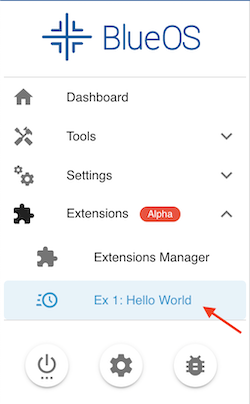

+++
title = "Extensions (Alpha)"
description = "BlueOS extensions documentation."
date = 2023-03-08T12:30:00+11:00
template = "docs/page.html"
sort_by = "weight"
weight = 40
draft = false
aliases = ['software/onboard/BlueOS-latest/development/extensions', 'software/onboard/BlueOS-latest/extensions', 'software/onboard/BlueOS-1.1/extensions']

[extra]
lead = ''
toc = true
top = false
+++


This page provides context and development guidance for Extensions. For _installing_ and _using_ Extensions please refer to the [Extensions Manager](../advanced-usage/#extensions-manager) section of the Advanced Usage page.


## Context

One of the primary aims of BlueOS is to be a platform that is readily extendable to the needs of each user. For maximum utility it should be easy to add support for custom hardware, add components to the user interface, and share developments with other BlueOS users, without compromising the base BlueOS experience.

Accordingly, BlueOS has been designed with a containerised architecture, so the core functionality is kept separate from Extensions, and each can be distributed and updated independently of the other. The built in Extension system allows developers and users to find and install add-on software packages to BlueOS, and manage updates, permissions, and resource limits of those Extensions through the [Extensions Manager](../advanced-usage/#extensions-manager).

For some additional context and discussion, please see [this forum thread](https://discuss.bluerobotics.com/t/external-integrations-extensions/10912) about the BlueOS Extensions architecture. Feel free to contribute ideas or ask questions there as relevant.

## Implementation


The BlueOS Extensions system is currently still in an `alpha` stage of development, so significant implementation changes are expected in the near future.


### Components: Anatomy of an Extension

At heart, a BlueOS Extension is some functionality (optionally with a web interface) packaged into a [Docker Image](../overview#docker), and combined with some metadata that allows it to be found, shared, and managed. Extensions may interface with existing services provided by BlueOS (or other Extensions), and some Extensions may create persistent logs and/or make use of data or files provided by the user.

Once installed, an Extension Package can be run as a [Docker Container](../overview#docker), which normally occurs automatically when the vehicle turns on, but can also be manually disabled/enabled via the Extensions Manager. When running, Extensions can have [custom permissions assigned](#metadata-dockerfile), which can limit resource-usage and/or allow access to parts of the host computer's hardware.

#### Metadata (Dockerfile)

The process of packaging a set of programs and files into a Docker Image requires a [Dockerfile](https://docs.docker.com/engine/reference/builder/), which can be thought of as recipe for building the Image.

For an Extension to be properly managed and shareable, the Dockerfile it's created from should include relevant metadata[^2] via the following labels:
- `LABEL permisions='{}'`
   - This can be used to set resource limits, including allowing access to specific components of the underlying hardware
   - This must be a valid JSON (use \ to break lines), which follows the configuration described in the [Docker Api](https://docs.docker.com/engine/api/v1.41/#tag/Container/operation/ContainerCreate)
   - For reference, existing permissions can be retrieved from a running Docker Container by running the command `docker inspect <container_name>`
      - Do not copy the whole output to use in your Extension - only the minimal requirements for the Extension to work
   - Common uses of the `permissions` label include:
      - Mapping/mounting a folder from the host device into the running Container
         ```dockerfile
         "HostConfig":\
           {\
             {\
               {\
                 "Binds":["/var/lib/zerotier-one:/var/lib/zerotier-one"]\
               }\
             }\
           }
         ```
      - Automatically mapping port 80 of the Container to a free port in the host
         ```dockerfile
         LABEL permissions='\
         {\
          "ExposedPorts": {\
            "80/tcp": {}\
           },\
           "HostConfig": {\
             "Binds":["/root/.config:/root/.config"],\
             "PortBindings": {\
               "80/tcp": [\
                 {\
                   "HostPort": ""\
                 }\
               ]\
             }\
           }\
         }'
         ```
      - Constraining CPU/memory usage (half a core)
         - This is important if your Extension is CPU or memory-hungry, as we need to ensure it doesn't affect the autopilot's operation
         ```json
         {
           "HostConfig":{
             "CpuPeriod":100000,
             "CpuQuota":20000,
             "Memory":209715200,
           }
         }
         ```
   - Our [Extensions Examples Repository](https://github.com/Williangalvani/BlueOS-examples) has some useful examples
- `LABEL version="1.0.0"`
   - Public Extension releases should use a [SemVer](https://semver.org/)-compliant version
   - We recommend using alpha/beta versions for non-stable (development) releases (e.g. `1.0.1-beta.16`)
- `LABEL authors`
   - The individual author(s) who have developed the Extension
   - Useful for giving credit, and as a potential support backup
   - This should be a list of JSON dicts, each containing a "name" and "email" key with corresponding values
   ```dockerfile
   LABEL authors='[\
       {\
           "name": "Me",\
           "email": "me@email.com"\
       },\
       {\
           "name": "Me Too",\
           "email": "me2@email.com"\
       }\
   ]'
   ```
- `LABEL company` (becoming `maintainer`)
   - The person or company responsible for maintaining the Extension
   - JSON object in the form
      ```json
      {
          "about": "brief description",
          "name": "Company/Person Name",
          "email": "email@company.com"
      }
      ```
- `LABEL readme`
   - A URL pointing to a markdown-based README file
      - Allows using `{tag}` to find versioned readme files without manually updating the URLs
      - e.g. `"https://https://raw.githubusercontent.com/Williangalvani/BlueOS-examples/{tag}/example4-vue-backend/Readme.md"`
- `LABEL links`
   - An arbitrary collection of relevant links, in a JSON dict
   - Recommended link type examples include
      ```json
      {
          "website": "https://...",
          "github": "https://github.com/...",
          "support": "mailto:support@company.com",
          "documentation": "https://docs.company.com/cool-extension/",
          "phone": "tel:+1234567890"
      }
      ```
- `LABEL requirements`
   - SemVer-compliant dependency requirements for this Extension to work correctly (with BlueOS and/or other Extensions)
   - format not yet finalised 
      - will likely be something like `repo/extension-name >= version`
- `LABEL type`
   - Useful for broad-strokes filtering when searching for/browsing Extensions
   - Not yet implemented in the Extensions Manager
   - Should be one of the following strings:
      - `"device-integration"`
      - `"theme"`
      - `"other"`
      - `"example"` (for Extension examples)
- `LABEL tags`
   - Useful for finer-grained filtering to help find relevant Extensions
   - Not yet implemented in the Extensions Manager
   - Must be alpha-numeric (no capital letters, no symbols except dashes)
   - Limited to 10 tags per extension
   - Some examples (focused around possible Extension functions):
      - `"positioning"`
      - `"navigation"`
      - `"mapping"`
      - `"data-collection"` (e.g. scientific sensor integrations)
      - `"communication"` (e.g. integration of an acoustic modem)
      - `"interaction"` (e.g. integration of a gripper / robot arm / brush)

[^2]:The metadata from the Docker labels is used to populate the [Repository Manifest](https://github.com/bluerobotics/BlueOS-Extensions-Repository/blob/gh-pages/manifest.json), which is used to include Extensions in the Extensions Manager.

#### Web Interface (HTTP Server)

If the Extension needs a visual interface[^3], the recommended approach is to provide a webpage that's accessible via the existing BlueOS web interface.

To do so requires the Extension to run a HTTP server[^4], at which it must serve a `register_service` endpoint in the format of a JSON dict with the following keys:
- `"name"`
- `"description"`
- `"icon"`
   - Select one of the [Material Design Icons](https://pictogrammers.com/library/mdi/)
   - Specify it in the form `mdi-icon-name` (e.g. `mdi-lightbulb`)
- `"company"`
   - The name of the company/person in charge of maintaining the Extension
- `"version"`
   - The SemVer-compliant version of the API that is accessible through the Extension's HTTP server
   - Not required to match the version of the Extension itself
      - e.g. the Extension may release a version with a new appearance, with no changes to the API/functionality
   - May be used in dependency requirement checks
- `"webpage"`
   - The official URL for the extension
- `"api"`
   - The official URL for the extension's API
- `"new_page"` (optional)
   - Boolean (`true`/`false`) specifying whether to open the extension in a new page instead of in a BlueOS frame

As an example:
```json
{
    "name": "BlinkLED",
    "description": "An intuitive application that blinks a LED.",
    "icon": "mdi-led-on",
    "company": "Lights End Darkness",
    "version": "1.0.1",
    "new_page": false,
    "webpage": "https://github.com/octocat/blink-led-BlueOS-extension",
    "api": "https://github.com/octocat/blink-led-BlueOS-extension/wiki/api"
}
```

Each registered Extension service will have an entry under the "Extensions" section of the BlueOS web interface sidebar menu:



[^3]:You can choose to not provide a web interface if your extension operates with no user input. The [VirtualHere Extension](https://github.com/Williangalvani/blueos-virtualhere) is a relevant example.
[^4]:You can use programs like [simple-http-server](https://github.com/TheWaWaR/simple-http-server) to serve static files for an Extension.

#### Functionality

Different types of Extensions have different functionality, and there are often a variety of tools available to provide that. When starting to develop extensions, we would generally recommend:
- Python to run stuff
   - Frequently using a web framework like Starlite/Flask/FastAPI to provide the backend of an interface
- Static HTML files to contain and display parts of an interface
- Our [Extensions Examples Repository](https://github.com/Williangalvani/BlueOS-examples) has some useful examples


### Examples: What do they Look like?

#### Device Integrations
- [Water Linked UGPS](https://github.com/waterlinked/blueos-ugps-extension)
- [Water Linked DVL](https://github.com/bluerobotics/BlueOS-Water-Linked-DVL)
- [Cerulean DVL](https://github.com/ceruleansonar/BlueOS-Cerulean-DVL/)
- [Nortek Nucleus](https://github.com/nortekgroup/nucleus_driver/tree/main/blueos_extension)

#### Examples
- [Static HTML file](https://github.com/Williangalvani/BlueOS-examples/tree/master/example1-statichtml)
- [Static HTML + MAVLink Communication](https://github.com/Williangalvani/BlueOS-examples/tree/master/example2-statichtml-mavlink)
- [Vuetify](https://github.com/Williangalvani/BlueOS-examples/tree/master/example3-vuetify)
- [Vue Backend](https://github.com/Williangalvani/BlueOS-examples/tree/master/example4-vue-backend)
- [GPIO Control](https://github.com/Williangalvani/BlueOS-examples/tree/master/example5-gpio-control)

#### Themes
- No examples yet

#### Other
- [VirtualHere](https://github.com/williangalvani/blueos-virtualhere)
   - USB over IP: used to present USB devices connected to the Onboard Computer as though they are plugged in to the Control Station Computer
- [ZeroTier](https://github.com/Williangalvani/ZeroTierOne)
   - Network extension/sharing: used to create a virtual private network that allows managing and controlling a vehicle remotely over the internet


### Where do they Live?

#### Online Packages
- Extension Packages are expected to be hosted on [Docker Hub](https://hub.docker.com/)
- To appear on the Extensions Manager store they must be registered in the [BlueOS Extensions Repository](https://github.com/bluerobotics/BlueOS-Extensions-Repository)
   1. Extensions are added to the store by opening a Pull Request (PR) against the repository, including a `metadata.json` file and an icon
      - [This is a good example](https://github.com/bluerobotics/BlueOS-Extensions-Repository/pull/7/files)
   1. Once the PR is merged, a continuous-integration job will automatically use the information from the provided metadata file to access Docker Hub and fetch the labels for all tags that are SemVer-compliant
   1. The fetched information is then compiled and published to the [Manifest file](https://github.com/bluerobotics/BlueOS-Extensions-Repository/gh-pages/manifest.json) in the `gh-pages` branch
   
#### Installed Extensions
Once installed on the [Onboard Computer](@/hardware/required/onboard-computer/index.md), Extensions are stored at `/var/lib/docker` in the file-system, but should be managed through the BlueOS [Extensions Manager](../advanced-usage/#extensions-manager).


### Ecosystem Attributes

#### Current Extensions Manager Features
- Install Extensions from store
- Runs installed Extensions on startup
- Track CPU and memory usage (per Extension)
- Manage/edit permissions (including limiting hardware resource access/usage)
- View Extension logs
- Disable Extensions
- Uninstall Extensions that are no longer wanted
- Manually update/rollback Extensions (select version)
- Create a custom Extension configuration
- Allow restarting Extensions

#### Planned Extensions Manager Features
- Notify users of available updates
- Support userdata file cleanup from Extensions (checks for dependencies)
- Improve permissions interface (to show what's available/requested)
- See more / track progress in the [Kraken development tracker](https://github.com/bluerobotics/BlueOS-docker/issues/1180)


## Development Process


Walkthrough coming soon!


- [Sneak peek diagram](https://github.com/bluerobotics/ardusub-zola/blob/BlueOS-1.1/extensions/development-process.mermaid)

