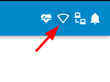
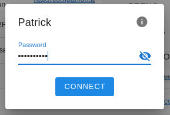
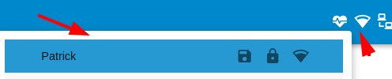
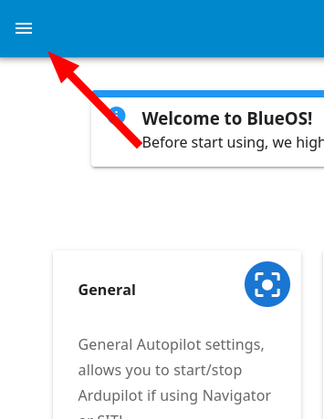
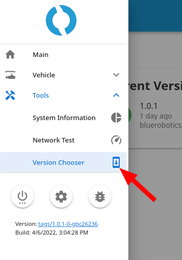
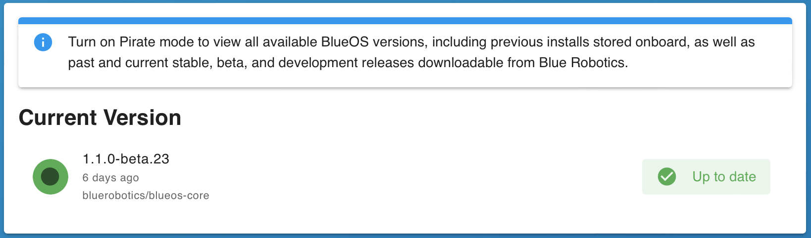

+++
title = "Getting Started"
description = "BlueOS getting started instructions."
date = 2023-02-23T23:15:00+11:00
template = "docs/page.html"
sort_by = "weight"
weight = 20
draft = false
aliases = ['/software/onboard/BlueOS-latest/getting-started', '/blueos/latest/getting-started']

[extra]
lead = ''
toc = true
top = false
+++
## Network Configuration

Your topside computer’s network configuration should be the same as for the previous Companion software.
To configure it, you can follow our [network setup instructions](https://www.ardusub.com/quick-start/installing-companion.html#network-setup).

## Web Interface

BlueOS is designed as a modular collection of services, which are accessed and configured via a combined web interface.

The web interface monitors the autopilot and other main software components. It also listens for and displays connections from other HTTP servers (on TCP ports), which allows extensions and custom integrations to provide an interface through BlueOS while remaining independent from the main BlueOS release/update cycle.

### Interface Access

- By default you can access BlueOS via [blueos.local](http://blueos.local/)
    - This applies if the BlueOS device is connected to via a direct ethernet connection, or [USB-OTG](#usb-otg)
    - On an ethernet connection you can also access BlueOS via its static IP address ([192.168.2.2](http://192.168.2.2/))
- When BlueOS is connected to the same wifi network as your device you can also connect with it using [blueos-wifi.local](http://blueos-wifi.local/)
- By default if BlueOS does not have a wifi connection configured within 5 minutes of booting, it will start its own wifi hotspot which, when connected to, allows accessing the BlueOS interface via [blueos-hotspot.local](http://blueos-hotspot.local/)

### Wizard

When BlueOS is newly installed the interface provides a configuration wizard to help get things set up. 

The Welcome section allows skipping the wizard if BlueOS and your vehicle have already been configured as desired:
{{ easy_image(src="wizard-welcome", width=450, center=true) }}

To support BlueOS and autopilot firmware updates, it is recommended for BlueOS to be connected to the internet:
{{ easy_image(src="wizard-wifi", width=450, center=true) }}

BlueOS supports multiple vehicle types, and allows selecting a quick-setup option for the most common ones:
{{ easy_image(src="wizard-vehicle", width=450, center=true) }}

Vehicle quick-setup involves setting appropriate parameters for the selected vehicle type and frame, as well as choosing a name for your vehicle, and changing the mDNS hostname if you would prefer to connect with something other than [http://blueos.local](http://blueos.local):
{{ easy_image(src="wizard-parameters", width=450, center=true) }}

Progress is displayed for any selected configuration changes, and an up to date autopilot firmware is downloaded and installed (if using a standard vehicle type):
{{ easy_image(src="wizard-progress", width=450, center=true) }}

A completion window is shown once all configuration is done:
{{ easy_image(src="wizard-complete", width=450, center=true) }}

### Interface Features

When you first open the web interface, you'll see a page that looks like this:
{{ easy_image(src="../advanced-usage/interface-overview", width="600") }}

As a brief overview,
- the header contains system health indicators and notifications, and some network and display configuration options
- the sidebar allows navigating between pages, and allows restarting, freeing up space, and reporting issues
- most pages show their content within the BlueOS interface sections, but some extensions open as full pages in a separate tab

For more details see the Advanced Usage [Interface Overview](../advanced-usage/#interface-overview) section.

## Updating / Releases

BlueOS supports [multiple release types](../overview/#release-types) - we recommend the latest stable version for most people. Releases and change-logs are available on the [GitHub releases page](https://github.com/bluerobotics/blueos-docker/releases).

### Connect Wifi

When starting out, it's important to connect to wifi so you can update to the latest suitable release.

1. First, click the wifi indicator to scan for available wifi networks

   
1. Select the desired network, type in the password, and click connect

   
1. Once connected, the wifi icon will change to show the signal strength, and the connected wifi network will be selected on the menu

   

### Select Version

Now that your BlueOS has an internet connection, you can perform the update to the latest available version.

1. Click on the hamburger menu (if the sidebar is not already open)

   
1. Under **Settings**, select [**BlueOS Version**](../advanced-usage/#blueos-version)

   
1. If you're already on the latest version, the right side of your Local Version will be blank. If not, you should see a blue **Update** button.

   

1. Once the update button is clicked the update process will run.
   Please wait until it finishes - it will automatically reload the webpage for you.

## Camera Streams

BlueOS is capable of configuring and streaming multiple cameras simultaneously. The first time it boots, it will automatically detect any connected H264-capable cameras and start streaming them. If not, make sure your camera is properly connected, and that BlueOS is on the latest available version. Reset settings and restart BlueOS if necessary.

Additional information is available in the Advanced Usage [Video Streams](../advanced-usage/#video-streams) section.

## USB OTG
It is possible to connect with a Raspberry Pi 4 through its USB-C port[^1]. Once it's connected, the interface should be available though [blueos.local](http://blueos.local)[^2].

[^1]:A Raspberry Pi draws more power than many computer USB ports can provide, so a USB-C connection should generally only be used for data transfer, with a separate [power supply](@/hardware/required/power-supply/index.md) (or through a powered USB hub).

[^2]:The `usb0` network interface is configured to use a DHCP server at `192.168.3.1` by default, which does **not** provide access via the [192.168.2.2](http://192.168.2.2) static IP address.

### Mac configuration
If you are using MacOS, make sure to allow the RNDIS/ethernet gadget:
{{ easy_image(src="allow-rndis", width="300") }}

MacOS will consider a USB-OTG connection as a valid source of internet, which can be avoided by reordering your network interfaces, making sure that wifi and your actual wired internet connection interface are used with higher priority.

{{ easy_image(src="network-settings", width="600") }}

{{ easy_image(src="network-service-order", width="400") }}
