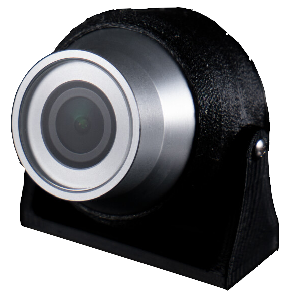

+++
title = "Camera"
description = "Allows the operator to see and record from the vehicle's point of view. If paired with a tilting mount or other gimbal it can be moved during operation."
date = 2022-10-11T17:33:19+11:00
template = "docs/page.html"
sort_by = "weight"
weight = 20
draft = false
[extra]
lead = ""
toc = true
top = false
+++

A valuable aspect of subsea robotics is being able to see underwater and at high pressures for extended periods, which aids navigation, inspections, exploration, and cleaning and repair work. Cameras can be located inside an electronics enclosure, or can be depth-rated and operate on the outside of the vehicle.

BlueOS (on the [Onboard Computer](../onboard-computer/)) includes a camera manager which can configure and stream multiple camera feeds to the [Control Station Computer](../control-computer/), from both USB and ethernet (IP) cameras. QGroundControl can switch between different video streams, but is currently only capable of displaying (and recording) one stream at a time, and only supports H.264-encoded streams. Additional video streams can be viewed in [external applications/software](https://discuss.bluerobotics.com/t/how-to-stream-another-cameras-video/9573/3#receiving-the-stream-7), including VideoLan (VLC) and Open Broadcast Studio (OBS).

## Supported Cameras

### USB Cameras

Most modern USB cameras are compatible with the BlueOS.

 

The following USB cameras have been tested to work:

* [Blue Robotics Low-Light HD USB Camera](https://www.bluerobotics.com/store/electronics/cam-usb-low-light-r1/)
* [DeepWater Exploration exploreHD](https://exploredeepwater.com/products/explorehd-rov-auv-usb-camera) (depth rated)

### Camera Serial Interface (CSI) Cameras

With a Camera Serial Interface (CSI) input on the Raspberry Pi, this type of camera may be used with the Companion software. A Raspberry Pi camera module came pre-installed on the BlueROV2 until mid-2017 when it was replaced by the Low-Light HD USB Camera.

{{ easy_image(src="rpicam", width=300) }}

The following CSI cameras have been tested to work:

* [Raspberry Pi Camera Module v2](https://www.raspberrypi.org/products/camera-module-v2/)

### Ethernet (IP) Cameras

An [Ethernet Switch](../../additional/ethernet-switch/) is required unless the camera stream is sent through an independent part of the [Tether](../tether/). The minimum requirements for working directly with QGroundControl are:

* H.264 Output
* RTSP

---

## Understanding Camera Properties

Choosing a camera setup for underwater use can be challenging, because a tradeoff must be made between the various properties of the camera, its lens, and the bandwidth required for streaming. If you are mostly interested in camera alternatives and improvements, there's a brief comparison table [here](https://discuss.bluerobotics.com/t/camera-lens-for-br-camera/10993/3#seeing-better-qualityresolution-1) of some options that have been posted about on the Blue Robotics forum.

The following points discuss the tradeoffs between different camera properties, with a focus on the underwater environment: 

### Higher Resolution
- assuming sufficient lighting and good enough optics, more pixels means clearer fine details, but 
- more pixels means more data to send, so requires more communication bandwidth and storage space, and reduces options for multiple additional cameras/sensors to be run at the same time
- also generally means the physical sensor for each pixel is smaller, which reduces low-light performance
- some high resolution cameras support moving the output frame when streaming at lower resolutions, which can allow for optical zooming, panning, and tilting without needing to move the camera itself - that's most effective with a wide-angle lens
### Higher Framerate
- the "time" equivalent of higher resolution - instead of finer details within an image, higher framerate captures more moments in time, so is better suited for capturing short events, or following fast objects -> results are generally perceived as "smoother"
- less time between frames also reduces the maximum exposure time, which can reduce the amount of light that can be captured (so can reduce low-light performance)
- more frames means more data, so uses additional communication bandwidth and storage space
### Improved Low-Light Performance
- primarily comes from a larger physical sensor, which can capture more photons
- better low-light performance means your lights don't need to be as strong, which reduces backscatter and bright reflections off bubbles and particles in the water
- [this forum comment](https://discuss.bluerobotics.com/t/new-product-bluerov2-full-electronics-and-software-upgrade/10652/4) shows the kind of difference it can make
### Wider Angle Lens
- a wider viewing angle means you can see more of what's around you without needing to turn the camera or vehicle
- a wider view into the same set of pixels means each pixel covers more area, so there's less fine detail that can be resolved
- human eyes have their own viewing angle they're used to seeing, so very wide angle camera views can be a bit disorienting
- a wider viewing angle means a larger portion of the viewing sphere is mapped onto the flat image plane, so the resulting image often looks quite distorted
### More Efficient Encoding (H265)
- H264 has been the standard high-efficiency stream encoding for many years, because it can be calculated quickly, has low bandwidth requirements, and produces videos that look similar to the captured input - it's currently the only option that's available by default in our vehicles
- H265 is the next generation beyond H264 - it requires some extra computation to encode (which can potentially add some latency), but it's a more efficient encoding -> either less data can be sent to achieve the same quality (so potentially more cameras could be streamed), or the same amount of data could be sent but with a significant quality improvement
- encoding is important for streaming, but efficient encodings work by removing data that humans aren't very good at seeing -> that's great if only humans are looking at the output, but makes it harder/less effective to do video processing and computer vision on the results
### Image Pre-processing
- encoding removes large amounts of data that may be helpful for processing, so if processing is going to occur it generally has better results if it can be done in real time on the raw image frames from the camera sensor, before they get encoded
- pre-processing on the camera makes the camera more complex and expensive, and the real-time requirement can place some limitations on what kinds of processing are feasible, and how much processing can be applied
- if the stream uses the processed results, the time taken to process any single frame is added to the stream latency, and too much display latency makes the vehicle feel unresponsive and harder to control
- if pre-processing is applied in the camera module to improve visibility/colour (as in the [DWE exploreHD](https://discuss.bluerobotics.com/t/a-new-high-quality-underwater-usb-camera/10279/15)), the video receiver can display better results that are easier to analyse and interpret as they appear
- some cameras support custom processing, which can be used for visibility improvements but also machine-learning detection of regions or objects of interest
- custom processing has the benefit that you can choose which processing you want to apply, and people can share results and benefit from each other's developments, but also means you need resources to develop processing that works well for your use-case, and/or access to others who have developed it already
